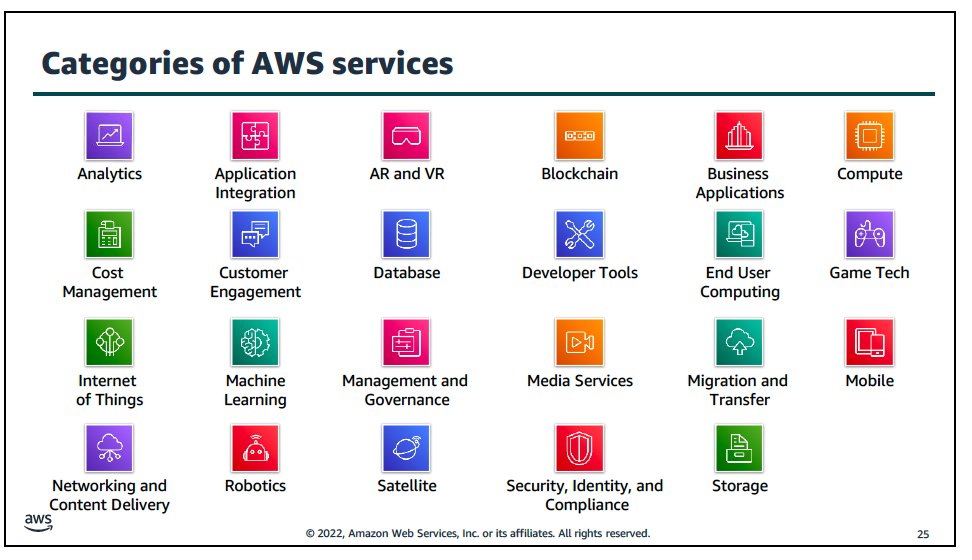
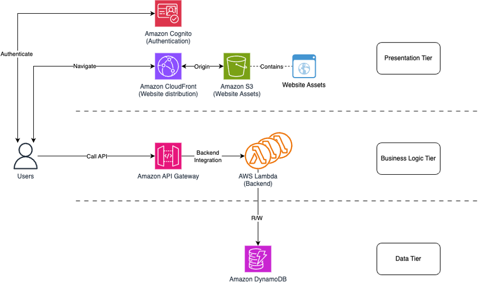

# Amazon Web Services (AWS) Overview ☁️


## Introduction

Amazon Web Services (AWS) is a comprehensive, on-demand cloud computing platform provided by Amazon since 2006.  
It offers scalable infrastructure, pay-as-you-go pricing, and over **200 fully featured services** distributed globally across multiple Availability Zones and Regions.

AWS serves organizations of all sizes—startups, enterprises, and government agencies—helping them innovate faster and operate securely in the cloud.

---

## AWS Global Infrastructure 🌍


### Structure

The AWS global infrastructure consists of:

| Component                  | Description                                                                                             |
| -------------------------- | ------------------------------------------------------------------------------------------------------- |
| **Region**                 | A physical location in the world that contains multiple, isolated Availability Zones.                   |
| **Availability Zone (AZ)** | A collection of one or more data centers in a Region with independent power, cooling, and connectivity. |
| **Edge Location**          | Used by **Amazon CloudFront** for caching and content delivery to end users with low latency.           |

### 2025 Statistics (as of October 2025)

- 38 AWS Regions
- 120+ Availability Zones
- 450+ CloudFront Edge Locations
- 20+ Wavelength & Local Zones for ultra-low latency compute

### Example

If your workload is in the **US East (N. Virginia)** Region, it may use AZs like `us-east-1a`, `us-east-1b`, etc.

Ref: [AWS Global Infrastructure](https://aws.amazon.com/about-aws/global-infrastructure)

---

## shared responsibility model 🔐


### Definition

The **AWS Shared Responsibility Model** defines how **security and compliance responsibilities** are divided between AWS and the customer.

- **AWS is responsible for security _of_ the cloud**  
  (physical, network, and hypervisor layers)
- **The customer is responsible for security _in_ the cloud**  
  (data, applications, encryption, IAM roles, and configurations)

### AWS Responsibilities

- Physical infrastructure and facilities
- Network and hardware maintenance
- Virtualization, hypervisor, and host operating systems
- Global service resilience and patching

### Customer Responsibilities

- Identity and access management (IAM policies, MFA)
- OS and application-level patching
- Network configurations and firewall rules
- Encryption of data at rest and in transit
- Data classification and compliance controls

Ref: [AWS Shared Responsibility Model](https://aws.amazon.com/compliance/shared-responsibility-model/) [web:59]

---

## Identity and Access Management (IAM) 🧩


### AWS IAM Overview

**AWS Identity and Access Management (IAM)** enables secure access control to AWS services and resources.  
It lets you define _who_ can access _what_ resources and _how_.

### Core Concepts

| Component    | Description                                                     |
| ------------ | --------------------------------------------------------------- |
| **Users**    | Individual identities representing people/applications.         |
| **Groups**   | Collections of users with shared permissions.                   |
| **Roles**    | Temporary credentials for trusted entities (e.g., EC2, Lambda). |
| **Policies** | JSON documents that define permissions.                         |

### Example: Basic IAM Policy

```bash
{
  "Version": "2012-10-17",
  "Statement": [
    {
      "Effect": "Allow",
      "Action": [
        "s3:GetObject",
        "s3:PutObject"
      ],
      "Resource": "arn:aws:s3:::mybucket/*"
    }
  ]
}

```

This policy allows the entity to read/write objects inside `mybucket` on Amazon S3.

---

## Key AWS Features ⚙️


### Core Benefits

- **Scalability:** Automatically scale to meet workload demands.
- **Reliability:** Redundant and fault-tolerant infrastructure.
- **Cost-Efficiency:** Pay-as-you-go pricing model.
- **Security:** Built-in compliance and encryption.
- **Flexibility:** Broad set of APIs and SDKs for integration.

---

## AWS Service Categories 🧭



| Category                 | Description                                    | Example Services           |
| ------------------------ | ---------------------------------------------- | -------------------------- |
| **Compute**              | Virtual machines & serverless computing.       | EC2, Lambda, ECS           |
| **Storage**              | Object, block, and archival storage solutions. | S3, EBS, Glacier           |
| **Database**             | Managed relational & NoSQL databases.          | RDS, DynamoDB              |
| **Networking & CDN**     | Connect apps securely & distribute content.    | VPC, Route 53, CloudFront  |
| **Security & Identity**  | Protect and control access to data.            | IAM, Cognito, KMS          |
| **Management Tools**     | Monitoring & automation services.              | CloudWatch, CloudFormation |
| **AI & Analytics**       | Process & analyze data intelligently.          | SageMaker, QuickSight      |
| **DevOps**               | Continuous integration and delivery.           | CodePipeline, CodeBuild    |
| **IoT & Edge**           | Connect and manage IoT devices.                | IoT Core, Greengrass       |
| **Migration & Transfer** | Migrate servers and databases.                 | DMS, Snowball              |

Ref: [AWS Whitepaper – Services by Category](https://docs.aws.amazon.com/whitepapers/latest/aws-overview/amazon-web-services-cloud-platform.html)

---

## Core AWS Services 🔑


### Compute Services

- **EC2** – Elastic virtual servers for scalable computing.
- **Lambda** – Serverless compute triggered by events.
- **ECS / EKS** – Container orchestration (Docker/Kubernetes).

### Storage Services

- **S3** – Object storage for unstructured data.
- **EFS** – Shared file storage.
- **Glacier** – Archival storage.

### Database Services

- **RDS** – Managed relational database.
- **DynamoDB** – NoSQL database with low latency.
- **Aurora** – AWS-optimized relational database.

### Security Services

- **IAM** – Identity & Access Management.
- **KMS** – Key Management Service for data encryption.
- **Shield & WAF** – DDoS and web security protection.

### Developer Tools

- **CodeBuild, CodeDeploy, CodePipeline** – CI/CD automation.
- **Cloud9** – Cloud-based integrated development environment.

---

## AWS Architecture Examples 🧩

### 1. Three-Tier Web Application



- **Front End:** CloudFront + ALB
- **Application Tier:** ECS (Fargate) or Lambda
- **Data Tier:** Aurora / DynamoDB
  Ref: [AWS Reference Architecture Library](https://aws.amazon.com/architecture/reference-architecture-diagrams)

### 2. Serverless Application Architecture


Services:

- API Gateway → Lambda → DynamoDB
- Cognito → handles authentication
- S3/CloudFront → serves static assets

---

## AWS Security Framework 🔐


AWS follows a **Shared Responsibility Model:**

- **AWS:** Secures the infrastructure (data centers, hardware, networking).
- **Customer:** Secures data, identity management, and applications.

Core Principles:

- **IAM policies and least privilege**
- **Encryption (KMS, TLS, S3 SSE)**
- **Monitoring via CloudWatch and GuardDuty**

Ref: [AWS Security Reference Architecture](https://docs.aws.amazon.com/prescriptive-guidance/latest/security-reference-architecture/welcome.html)

---

## Getting Started with AWS 🏁


1. **Create an AWS Account** – [https://aws.amazon.com](https://aws.amazon.com)
2. **Explore the Console** – Try EC2 and S3 through Free Tier.
3. **Set up IAM Users and Roles** – Secure your account before development.
4. **Learn through Tutorials** – Complete the AWS “Getting Started” labs.
5. **Experiment with CloudShell or AWS CLI** – Practice automation.

Ref: [AWS Getting Started Hub](https://aws.amazon.com/getting-started)

---

## AWS Certification Path 🎓

| Level        | Certification                             | Purpose                             |
| ------------ | ----------------------------------------- | ----------------------------------- |
| Foundational | Cloud Practitioner (CLF-C02)              | Cloud concepts and billing models   |
| Associate    | Solutions Architect / Developer / SysOps  | Core hands-on architecture skills   |
| Professional | Solutions Architect / DevOps Engineer     | Advanced enterprise-level expertise |
| Specialty    | Security / ML / Data Analytics / Database | Deep domain-specific mastery        |

---
