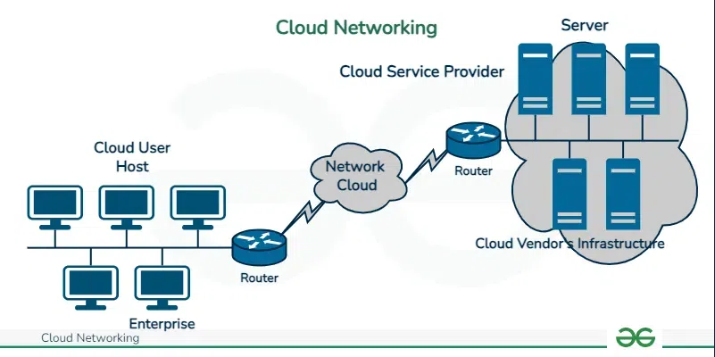
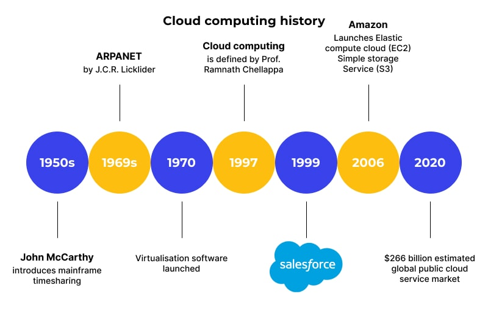
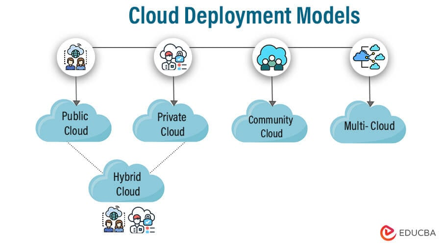
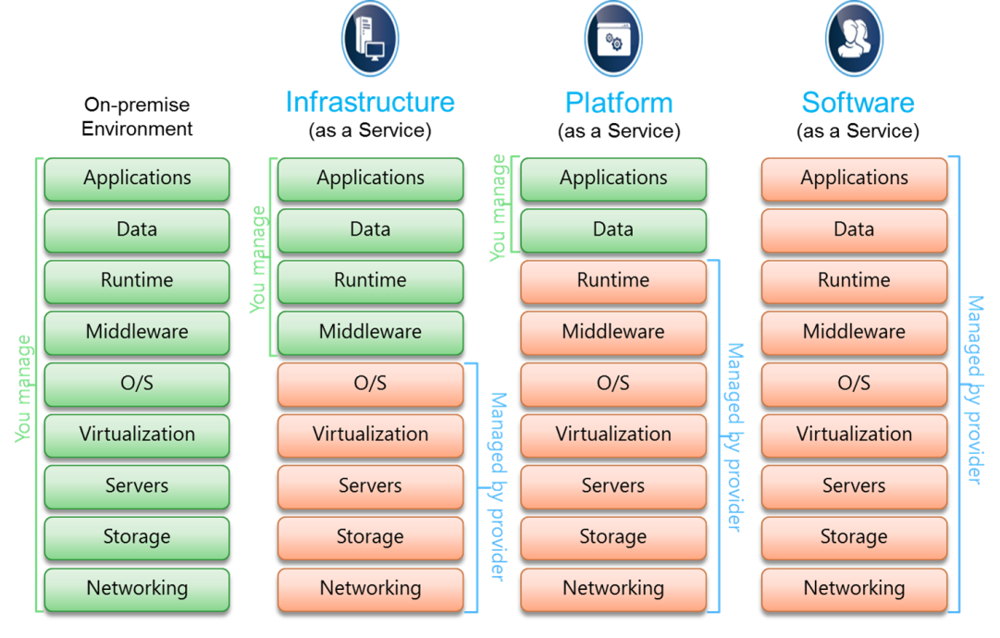
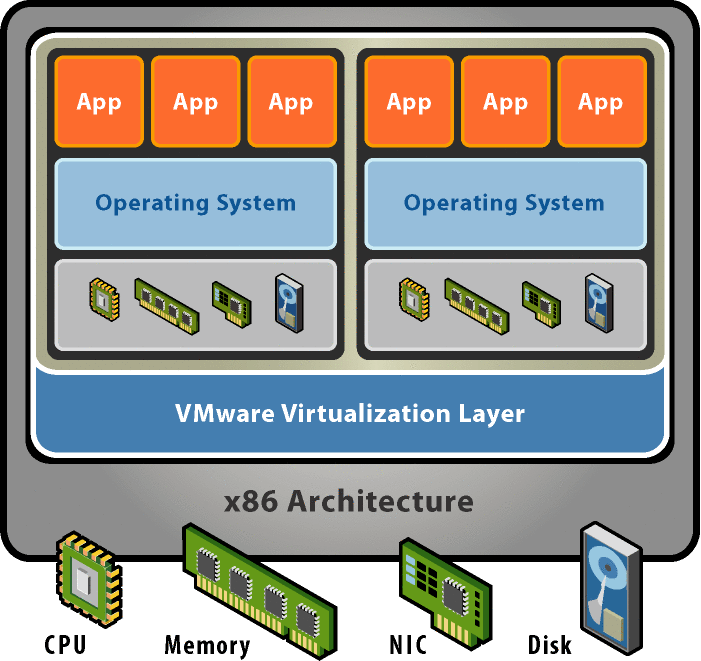
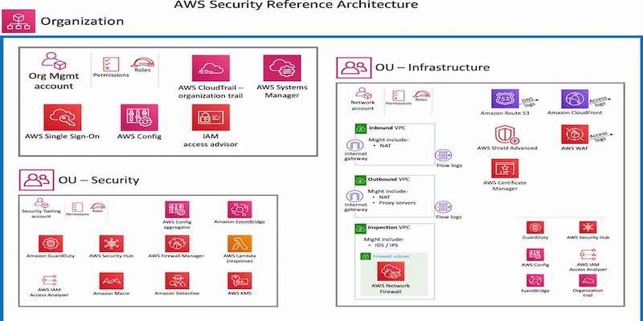
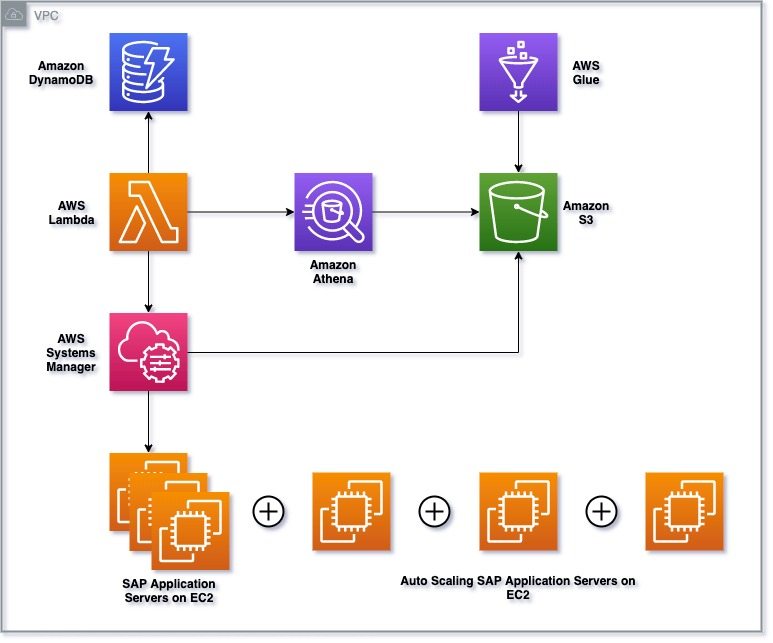
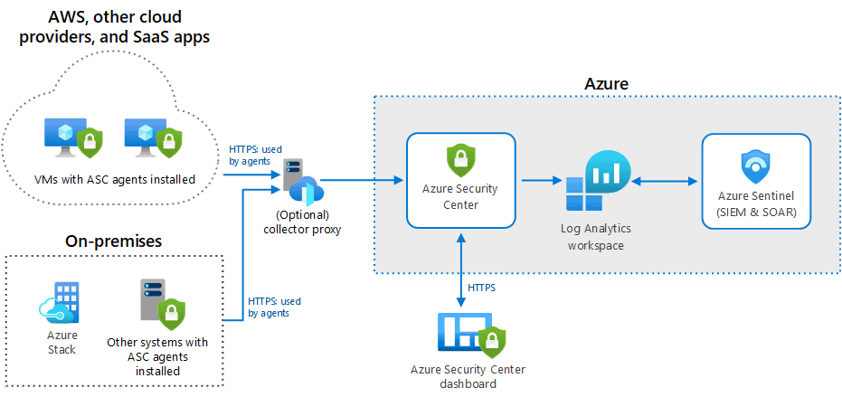
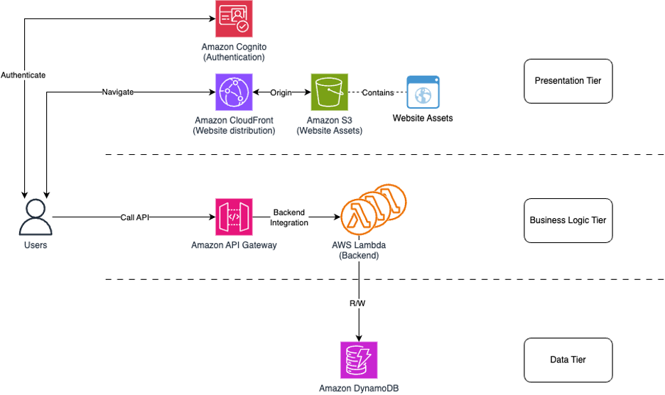

# Cloud Computing Fundamentals ☁️

## Introduction

Cloud computing means renting computer resources like servers, storage, databases, and applications through the internet instead of buying and managing physical hardware yourself.

Think of it like using **Netflix** instead of buying DVDs.  
You use what you need (movies or computing power), pay as you go, and access it from anywhere.

### Core Principles

- **On-demand self-service:** You can create or shut down resources (like servers) anytime without calling support. Example: Launching a virtual machine on AWS.
- **Broad network access:** You can access your data or services from your laptop, tablet, or phone online.
- **Resource pooling:** Cloud providers host multiple customers on shared servers but keep data isolated.
- **Rapid elasticity:** Your resources automatically scale up when an app gets more traffic—like how YouTube handles millions of viewers at once.
- **Measured service:** You pay based on your usage. Example: Paying per hour for an EC2 instance or storage used in S3.

---

## Evolution of Cloud Computing

- **1960s:** Mainframes allowed multiple users to share large computers (like time-sharing labs in universities).
- **1990s:** Internet and virtualization technology evolved, making it possible to run multiple “virtual computers” on one machine.
- **2006:** Amazon launched **AWS EC2**, introducing on-demand computing to everyone.
- **2010s:** Serverless computing and containers (like Docker) became popular—apps could run without managing servers.

📘 _Example:_ Earlier, companies bought racks of servers for websites. Now, they just rent servers from AWS or Azure and scale automatically.

---

## Cloud Deployment Models

| Model               | What it Means                                                     | Example Scenario                                                        |
| ------------------- | ----------------------------------------------------------------- | ----------------------------------------------------------------------- |
| **Public Cloud**    | Shared infrastructure owned by providers like AWS, Azure, or GCP. | Startups hosting websites globally (e.g., Netflix on AWS).              |
| **Private Cloud**   | Infrastructure dedicated to one organization.                     | Banks that need extra data control.                                     |
| **Hybrid Cloud**    | Combination of private & public clouds.                           | Hospitals keeping patient data private but using public cloud for apps. |
| **Community Cloud** | Used by multiple organizations with similar requirements.         | Research institutions sharing computing for climate studies.            |

---

## Cloud Service Models

### The Big Three

| Model                                  | Definition                                                  | Real-world Example                                               |
| -------------------------------------- | ----------------------------------------------------------- | ---------------------------------------------------------------- |
| **IaaS (Infrastructure as a Service)** | You manage apps; the provider manages hardware.             | Renting AWS EC2 virtual servers.                                 |
| **PaaS (Platform as a Service)**       | Provider gives you a ready environment for app development. | Deploying apps using Google App Engine or AWS Elastic Beanstalk. |
| **SaaS (Software as a Service)**       | Ready-to-use software delivered via the web.                | Gmail, Zoom, or Canva—all you do is log in and use.              |

_Tip:_ IaaS = Most control, SaaS = Least control, PaaS = Middle ground.

---

## Cloud Architecture

The cloud has different layers that work together, just like how a restaurant works:

| Layer                    | Description                                         | Example                            |
| ------------------------ | --------------------------------------------------- | ---------------------------------- |
| **Client Interface**     | The front-end where users access apps.              | Web browser or mobile app.         |
| **Application Layer**    | Software that performs tasks.                       | AWS Lambda or Heroku apps.         |
| **Virtualization Layer** | Converts hardware into flexible, virtual resources. | VMware, Hyper-V.                   |
| **Storage Layer**        | Where your data lives safely.                       | Amazon S3 or Google Cloud Storage. |
| **Network Layer**        | Connects everything together on the internet.       | Routers, firewalls, DNS.           |

📘 _Analogy:_ Think of Netflix again: The client layer is your app, the application layer streams your movie, the storage layer keeps your movie files, and the network layer delivers them quickly.

---

## Virtualization Technology

Virtualization lets one physical server run many "virtual" computers (virtual machines).  
It’s like cutting a big pizza into slices—each slice (VM) acts like its own computer.

| Type                        | Example        | Purpose                                          |
| --------------------------- | -------------- | ------------------------------------------------ |
| **Hardware Virtualization** | VMware, KVM    | Run multiple OS on one machine.                  |
| **Network Virtualization**  | Cisco SDN, NSX | Create multiple networks inside a single system. |
| **Storage Virtualization**  | vSAN           | Combine multiple drives into one pool.           |
| **OS Virtualization**       | Docker, LXC    | Run isolated containers in one OS.               |

📘 _Example:_ On your laptop, you can run Windows, Linux, and macOS using virtualization software.

---

## Cloud Security & Governance

### The Shared Responsibility Model

Security in cloud computing is teamwork:

| AWS Responsibility                                                          | Customer Responsibility                                       |
| --------------------------------------------------------------------------- | ------------------------------------------------------------- |
| Secures the physical infrastructure, networking, and virtualization layers. | Manages data, user access (IAM), permissions, and encryption. |

📘 _Example:_  
AWS secures the data center; you secure who can access your data in S3.  
Just like an apartment building—AWS builds and locks the doors; you keep your apartment safe.

Common tools:

- IAM (Identity and Access Management)
- Encryption (S3 & KMS)
- Firewalls and WAF
- Continuous monitoring via CloudWatch

---

## Scalability and Reliability in the Cloud

Scalability means your cloud infrastructure can **grow or shrink** automatically based on demand.

| Mechanism                    | Description                                       | Example                                         |
| ---------------------------- | ------------------------------------------------- | ----------------------------------------------- |
| **Horizontal Scaling (Out)** | Add more instances.                               | E-commerce site adding servers during sale day. |
| **Vertical Scaling (Up)**    | Upgrade current instance specs.                   | Upgrading from 2GB to 8GB memory.               |
| **Load Balancing**           | Distribute traffic to multiple servers.           | Netflix balances millions of user connections.  |
| **Fault Tolerance**          | System keeps running even if one component fails. | Data replicated across multiple AWS regions.    |

---

## Hybrid Cloud Reference Design

Hybrid Cloud connects your on-premises data centers to the public cloud.

📘 _Example:_  
Banks use private infrastructure for sensitive financial data while analyzing customer trends using AWS.

---

## AWS Multi-Tier Example

A popular cloud design uses **three layers**:

1. **Presentation Layer:** The user interface—webpages, apps, CloudFront CDN.
2. **Application Layer:** Business logic—the actual work done on AWS Lambda or ECS.
3. **Database Layer:** Where data is stored—Amazon RDS (SQL) or DynamoDB (NoSQL).

📘 _Example:_  
An online shop’s frontend shows products (Layer 1), the backend processes payments (Layer 2), and all orders are stored in a database (Layer 3).

---

## Summary

Cloud computing is like using electricity—you don’t manage power plants; you just use the energy.  
In the same way, instead of owning servers, businesses rent computing resources from providers like AWS, Google Cloud, or Azure.

Learn these ideas deeply first, and when you move to AWS, you’ll see these same principles applied in real AWS services like EC2, S3, IAM, and RDS.

---
