# EC2 Storage: Overview & Concepts

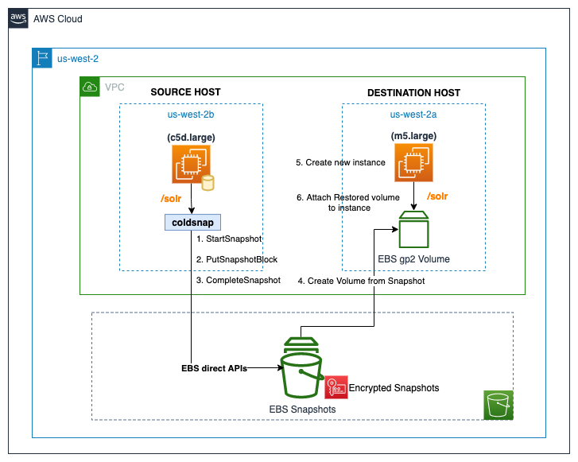

## Why Storage is Important for EC2?

Every server (whether on AWS or at home) needs storage for:

- The Operating System (Linux, Windows, etc.)
- Applications and data (files, logs, databases)
- Temporary data (like downloads or cache)

EC2 lets you pick various storage types based on performance, durability, and cost—just like you pick hard drives or SSDs for your own computer.

---

## Types of EC2 Storage

### 1. Amazon EBS (Elastic Block Store)

- **The default and most popular option.**
- Acts like an external hard drive for your EC2 instance: you can attach, detach, resize, and move these volumes.
- **Persistent:** Data stays safe even if you stop or restart your instance.
- **Backup:** You can take snapshots (backups) and restore your server easily.

**Everyday Analogy:**  
Think of EBS like a USB drive plugged into your laptop—your files are there even if you power off.

**Example Use Cases:**

- Run a database: Data must persist across reboots.
- Store website files and logs safely.
- Add or change storage as your needs grow.

**EBS Volume Types (choose what fits your workload and budget):**

- General Purpose SSD (gp3, gp2): Balanced for most uses (web servers, dev/test).
- Provisioned IOPS SSD (io1, io2): High-performance, low-latency (databases).
- Throughput Optimized HDD (st1): Big data, streaming workloads.
- Cold HDD (sc1): Cheap storage for infrequently accessed files.

---

### 2. Instance Store (Ephemeral Storage)

- Temporary local disks physically attached to the compute host.
- **Super fast and great for short-term needs.**
- **Ephemeral:** Data is wiped if you stop/terminate/reboot your instance.
- Not available on all instance types.

**Everyday Analogy:**  
Like a computer’s RAM disk or temporary download folder—very fast, but don’t store anything important!

**Example Use Cases:**

- Storing cache files, logs, or buffers
- High-speed read/write temporary data
- Data replicated elsewhere so loss is acceptable

---

### 3. Amazon S3 (Simple Storage Service)

- Not directly attached to the instance but used for storing backups, AMIs, website assets, and snapshots.
- **Highly durable and scalable object storage.**
- Access anytime over the internet or privately within AWS.

**Everyday Analogy:**  
Like Google Drive or Dropbox for your server—access files from anywhere.

**Example Use Cases:**

- Back up your EBS volumes as snapshots
- Store images, videos, or documents with unlimited scale
- Share files between instances or with users

---

### 4. Amazon EFS (Elastic File System)

- Shared network file system—multiple Linux EC2 instances can mount at once.
- Ideal for distributed apps, content management, and data sharing.

**Everyday Analogy:**  
A shared folder on your office network—everyone on the team can use files together.

**Example Use Cases:**

- Web clusters needing shared access to code/media
- Collaborative scientific/data projects

---

### 5. Instance Storage-Optimized Instances

- EC2 "I", "D", and "H" family types offer massive, local, high-speed storage for database, analytics, and real-time workloads.
- Data is temporary—choose only if your app manages its own data replication or doesn't care about loss when powered off.

---

## Which EC2 Storage Should You Use?

| Scenario                         | Best Option    | Why?                                  |
| -------------------------------- | -------------- | ------------------------------------- |
| General-purpose web app/database | EBS gp3 SSD    | Persistent, balanced performance      |
| High-performance database        | EBS io2 SSD    | Super-fast, steady, low-latency       |
| Big data analytics/logs          | EBS st1 HDD    | High throughput for sequential access |
| Temporary cache/scratch data     | Instance Store | Fast, but will be lost on stop/delete |
| Team file sharing                | EFS            | Network file system, multi-instance   |
| Cheap, scalable backup/offload   | S3             | Safe, durable, not tied to any server |

---

## Real-World Examples

- **Startup web app:** 20 GB EBS (`gp3`) for app files + S3 for images.
- **Big data job:** Instance store volumes for calculation + EBS for results.
- **Clustered Linux servers:** All mount the same EFS for shared config.
- **Database:** Critical production DB on EBS (`io2`), regular snapshots to S3.

---

## Summary

EC2 storage is flexible—use persistent EBS for anything important, instance store for short-lived scratch, S3 for mass storage or backups, and EFS for file sharing among Linux servers.  
By matching storage type to need, you save money, keep data safe, and build fast, reliable cloud solutions.

# How to Create and Attach an EBS Volume to an EC2 Instance

---

## Step 1: Go to Volumes in EC2 Dashboard

- Open the AWS Console and search for **EC2**.
- Under **Elastic Block Store** in the left sidebar, click on **Volumes**.

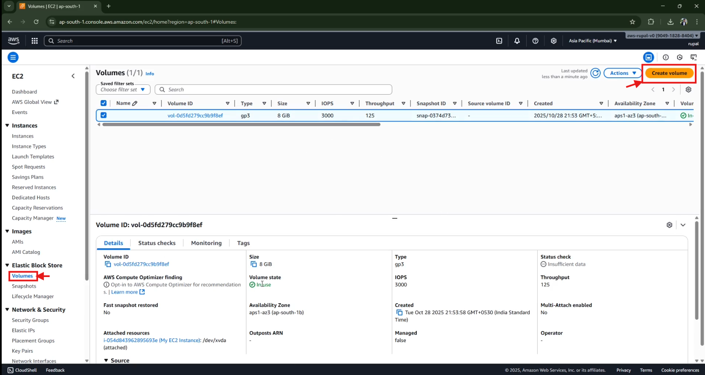

---

## Step 2: Click "Create Volume"

- On the Volumes page, click the **Create volume** button in the top right.

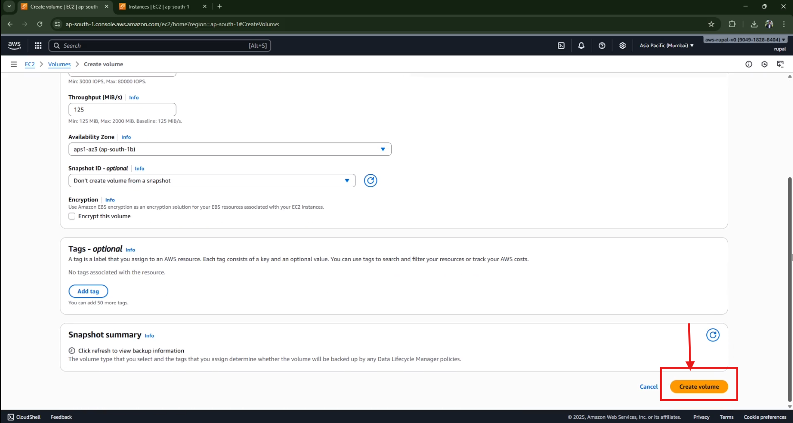

---

## Step 3: Fill Out Volume Settings

- Pick a **volume type** (gp3 is fine for most workloads).
- Enter the **size** in GiB.
- Make sure the **Availability Zone** matches your instance’s AZ.
  - Example: If your instance is in `ap-south-1b`, your volume should be in the same.
- Leave “Snapshot ID” empty to create a brand new empty volume.

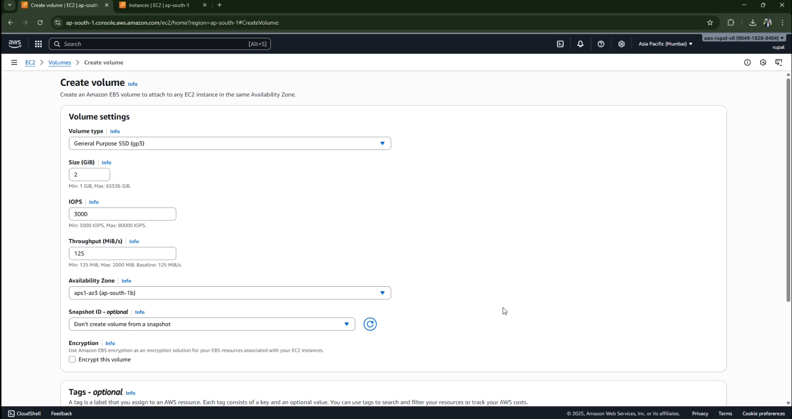

---

## Step 4: Click "Create Volume"

- Double check settings and click **Create volume**.

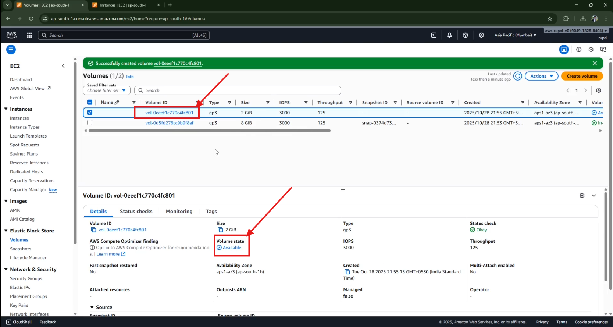

---

## Step 5: Select the Created Volume & Click "Attach Volume"

- Find your new volume in the list (state should be “available”).
- Click **Actions → Attach volume**.

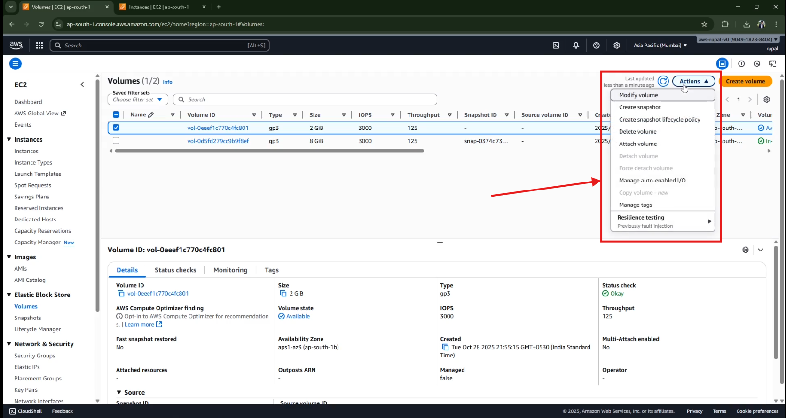

---

## Step 6: Choose Instance and Device Name

- In the dialog, select your **running EC2 instance** from the dropdown.
- For Linux, use a device name like `/dev/sdb` for data volumes.
- Click **Attach volume**.

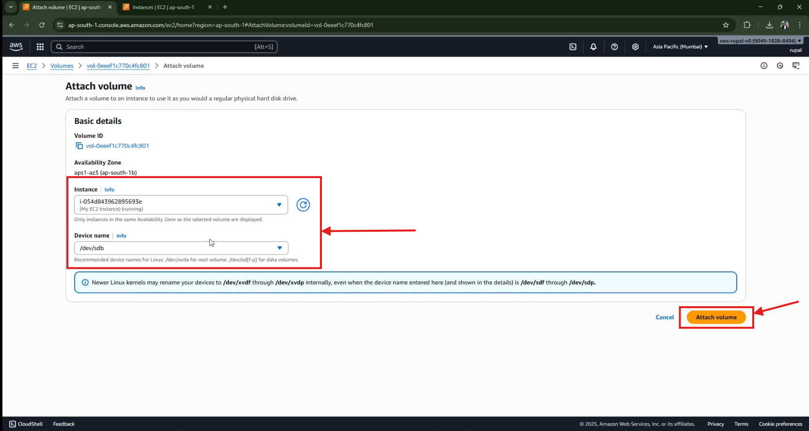

---

## Step 7: Verify the Volume is Attached

- Go back to your **EC2 Instances** page.
- Select your instance, then view the **Block devices** listed.
- You should see your new volume (`/dev/sdb`) as “attached”.

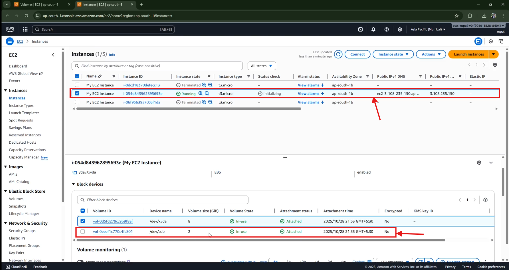

---

## What’s Next?

- If your instance runs Linux, you need to format and mount the volume so your system can use it (via SSH, run `lsblk`, `mkfs`, and `mount`).
- For Windows, use Disk Management to bring the disk online and format it.

---

## Summary

In these simple steps, you’ve added extra storage to your running EC2 server—just like plugging an external drive into a PC.  
This is perfect for growing apps, separating data, and backing up files.

# Creating Snapshots from EBS Volumes & Managing Snapshots

---

## Step 1: Select Volume and Create Snapshot

- Go to **Volumes** under Elastic Block Store in EC2.
- Click the volume you want to back up.
- From the **Actions** menu, click **Create snapshot**.

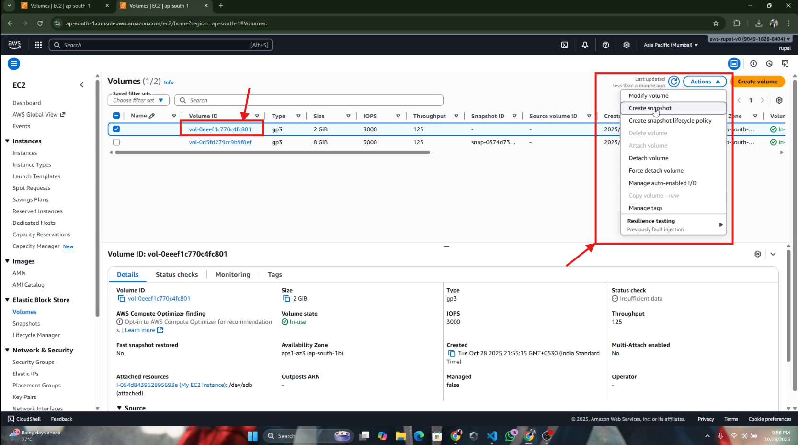

---

## Step 2: Give Your Snapshot a Description and Create

- In the dialog, enter a meaningful description (e.g. "MyDemoSnapshot").
- Click **Create snapshot**.

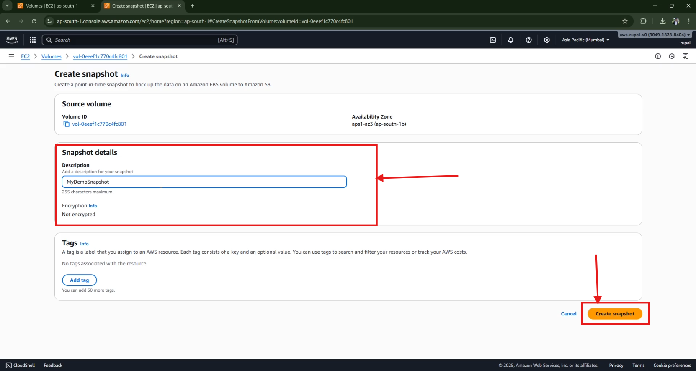

---

## Step 3: Verify Your Snapshot

- Go to **Snapshots** in the left sidebar.
- Your new snapshot will appear in the list.
- Check that **Snapshot Status** is "Completed" and progress is 100%.

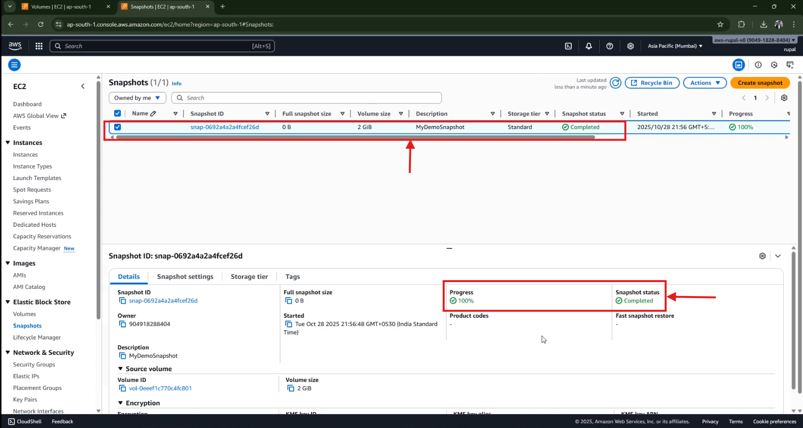

---

## Step 4: Snapshot Actions (Create Volume, Copy, Delete)

### A. Create a Volume from Snapshot

- Select the snapshot, open **Actions** and click **Create volume from snapshot**.
- Fill in the desired volume type, size, and availability zone.

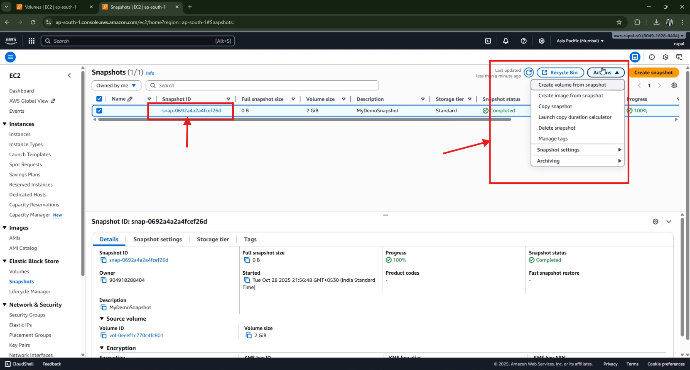
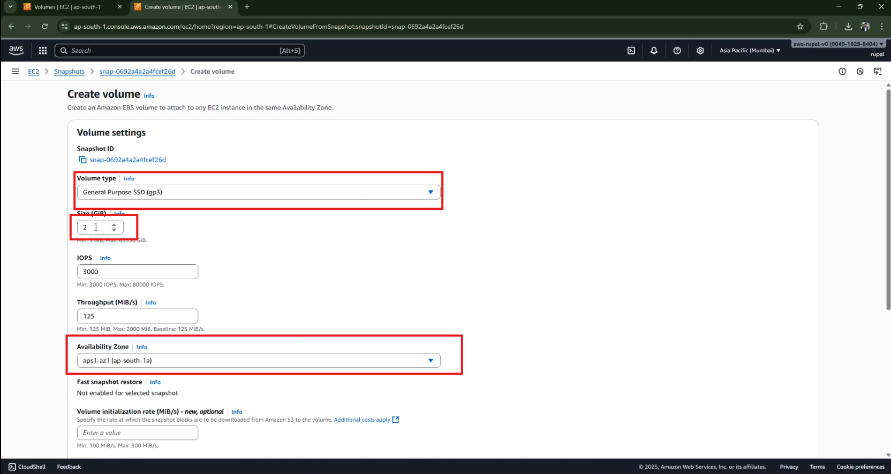
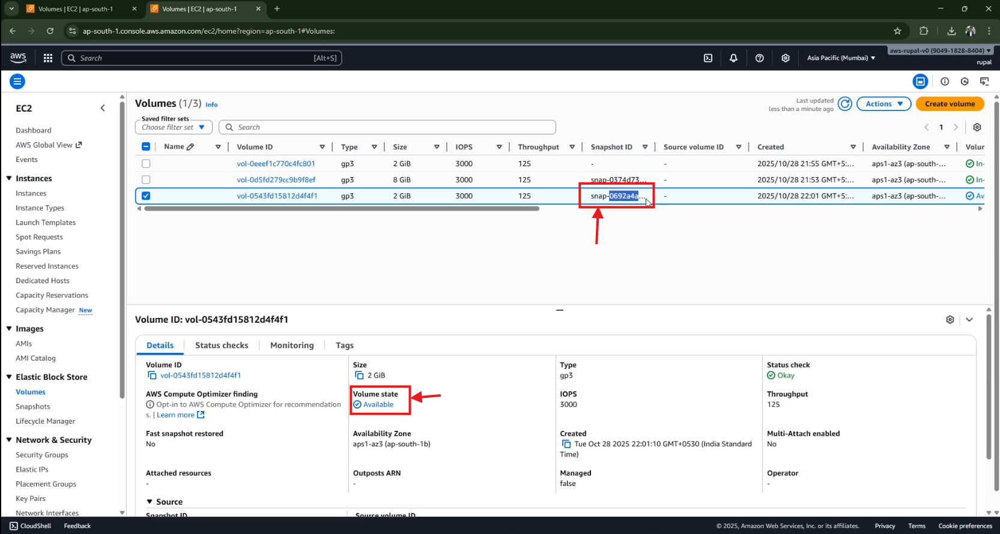

### B. Copy Snapshot to Another Region

- With snapshot selected, choose **Actions → Copy snapshot**.
- Pick the destination region and description.

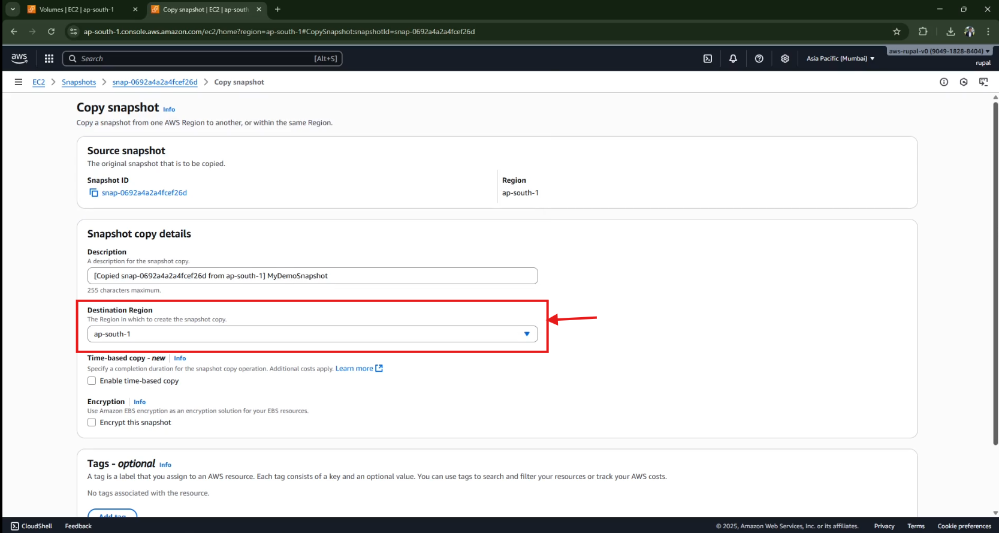

### C. Delete Snapshot & Recycle Bin Recovery

- When you delete a snapshot, it goes to the AWS Recycle Bin (if retention policy exists).
- To recover, go to **Recycle Bin → Resources**, select the snapshot, and click **Recover**.

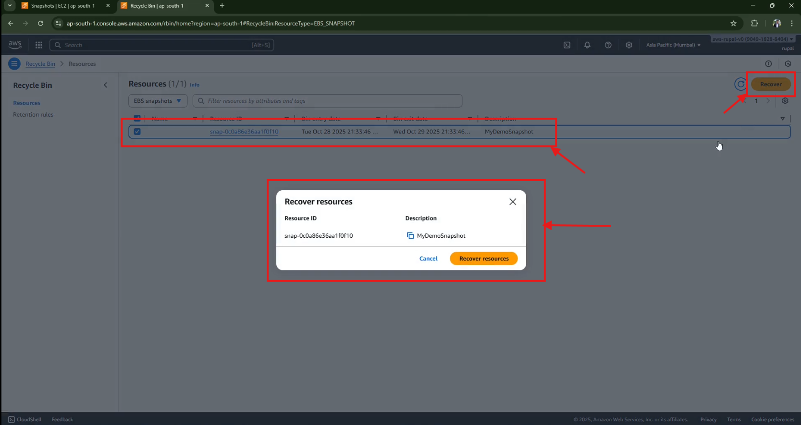

---

## Step 5: Set Up Retention Rules for Snapshots

- In **Recycle Bin → Retention rules**, create a new rule.
- Choose resource type **EBS snapshots**, and whether to retain all or by tag.
- This ensures deleted snapshots are recoverable for a set number of days.

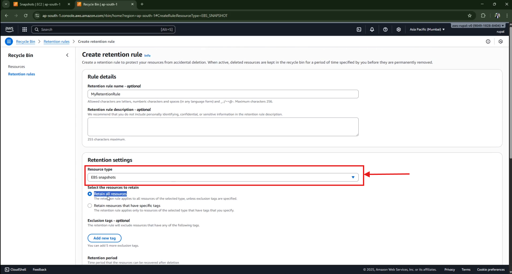

---

## Summary

**EBS Snapshots** let you:

- Back up and restore volumes at any time.
- Clone volumes for different regions or Availability Zones.
- Recover mistakenly deleted snapshots easily when using retention rules.
- Keep your cloud data safe with easy, point-in-time recovery.

# How to Create and Attach an Amazon EFS File System

---

## Step 1: Search for EFS in AWS Console

- From the AWS Console, search for **EFS**.
- Select **EFS (Managed File Storage for EC2)**.

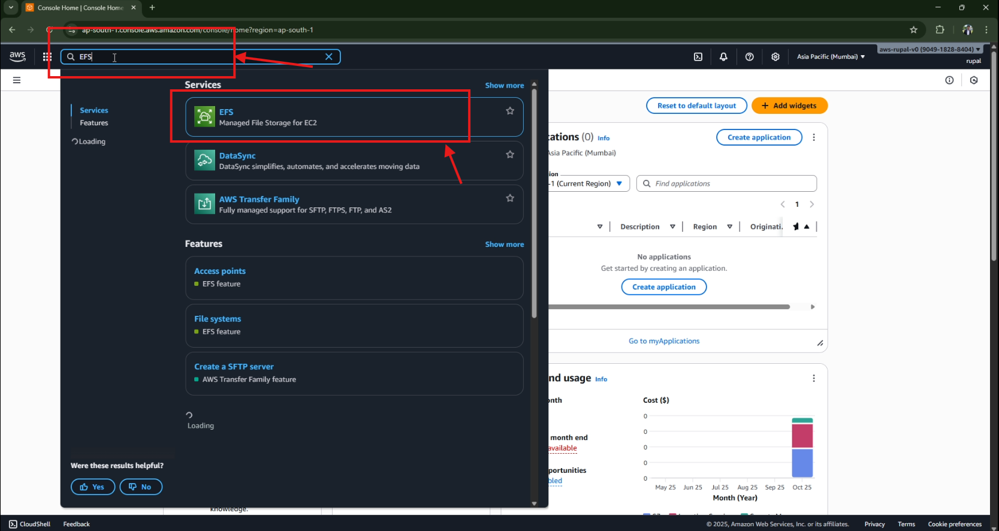

---

## Step 2: Click "Create file system"

- On the EFS dashboard, click **Create file system**.

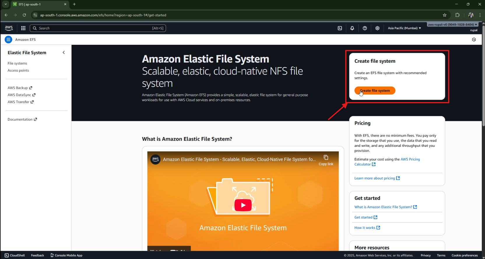

---

## Step 3: Enter EFS Name and Choose Settings

- Give your file system a name (optional but recommended).
- You can go with the default (recommended settings) or click **Customize** for advanced options.

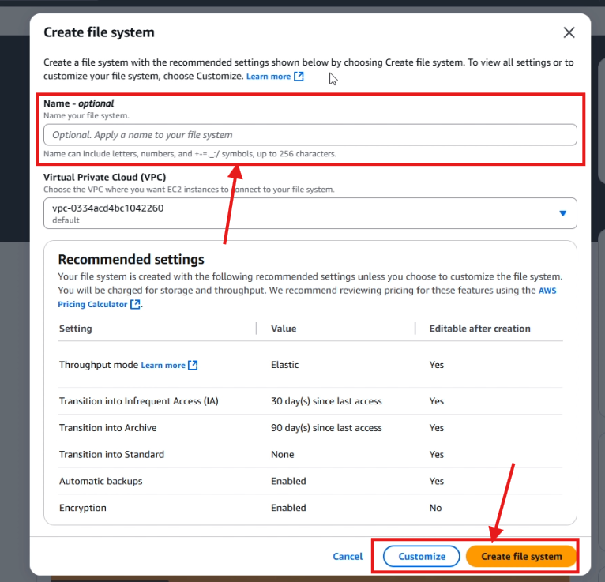

---

## Step 4: Set File System Type and Lifecycle (Customize - Optional)

- On the customize screen, choose **Regional** for maximum durability (recommended).
- Configure lifecycle transition rules if you want files to move to infrequent or archive storage based on last access (good for saving costs over time).

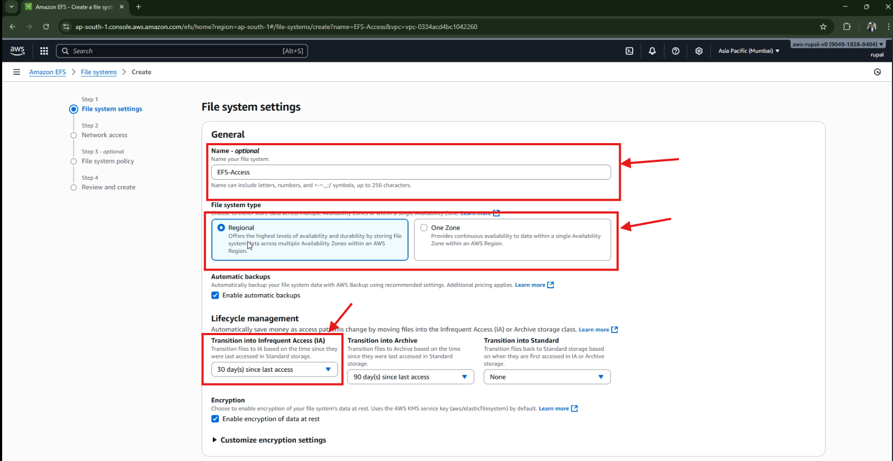

---

## Step 5: Set Network and Mount Targets Across AZs

- Select your VPC and subnets for each Availability Zone.
- EFS creates **mount targets** in each AZ, enabling high availability and cross-AZ access.

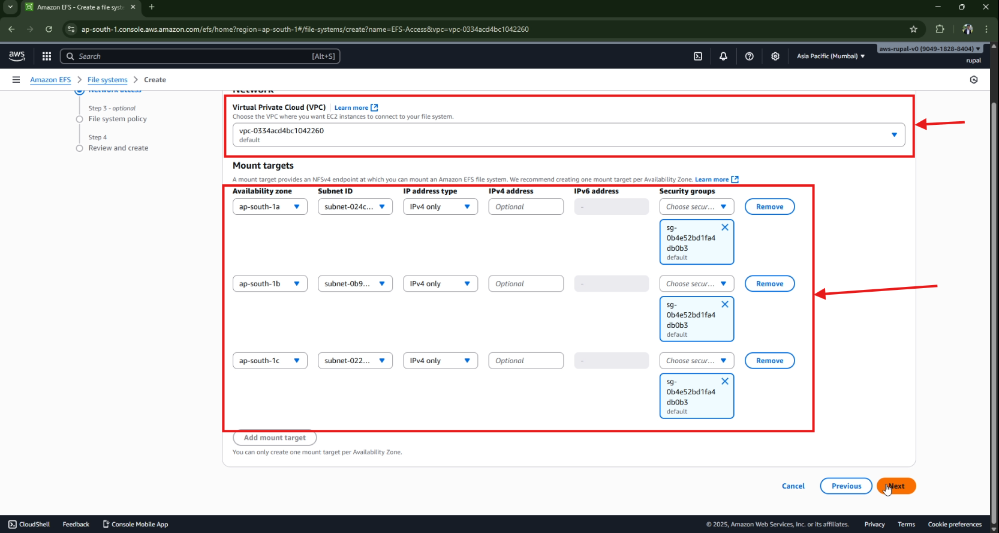

---

## Step 6: File System Policy (Optional)

- Expand the **File system policy** section to restrict actions using resource policies if required.
- This helps manage security for who can access the file system.

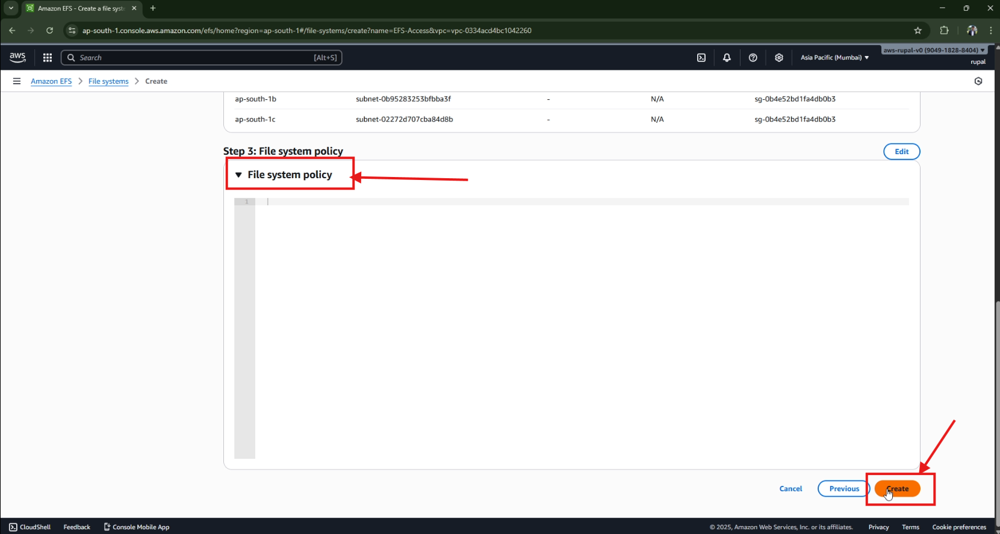

---

## Step 7: Click "Create"

- Review your settings, then click **Create** to provision the EFS.

---

## Step 8: Verify EFS Creation

- EFS will appear in your file systems list, status as "Creating" and then "Available".

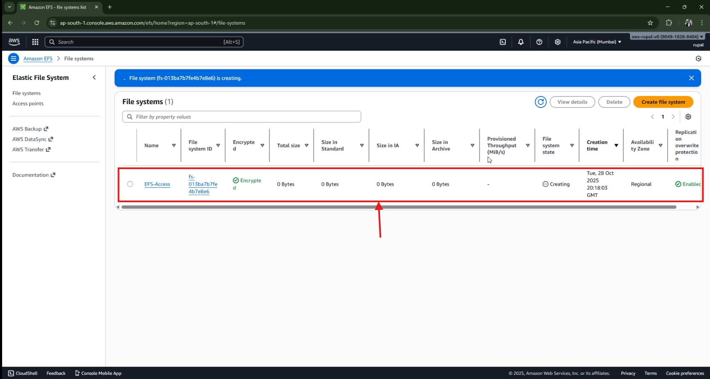

---

## Step 9: Attach EFS to EC2 When Launching Instance

- When launching an EC2 instance, in **Storage (volumes)**, go to **File systems**.
- Choose “Add shared file system” and select your new EFS from the list.

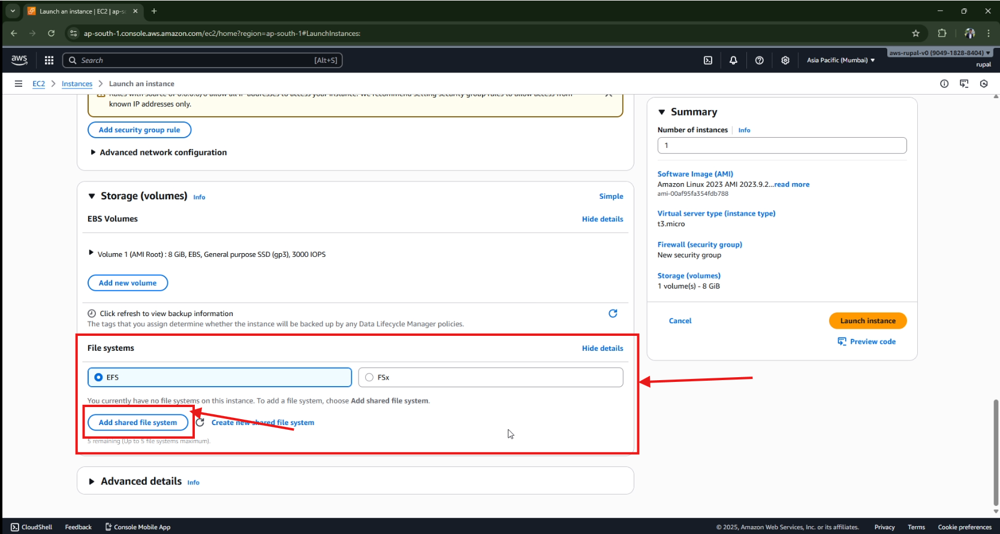
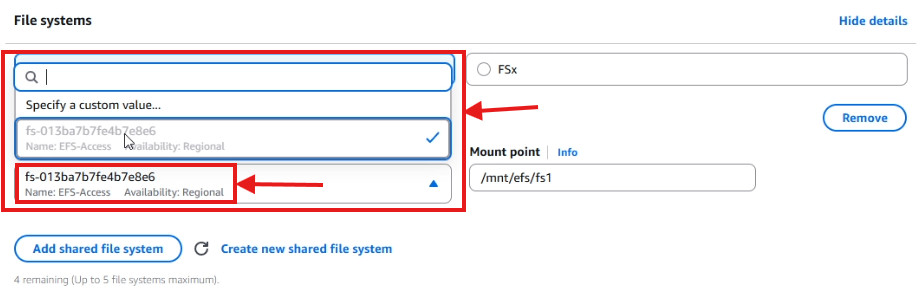

---

## Step 10: Select Correct Subnet (AZ)

- In **Network settings** during instance creation, choose a subnet in the same Availability Zone as one of the EFS mount targets for optimal performance.

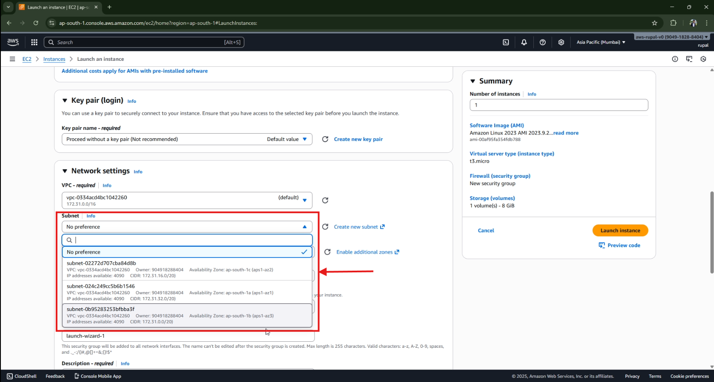

---

## Summary

With these steps, you:

- Created an EFS file system that can be shared by many EC2s (like a NAS for your cloud).
- Attached it to your EC2 by selecting EFS on launch, or by mounting it on existing instances.
- Set lifecycle and accessibility rules for durability, cost management, and security.
