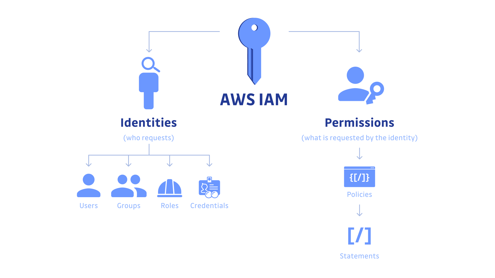
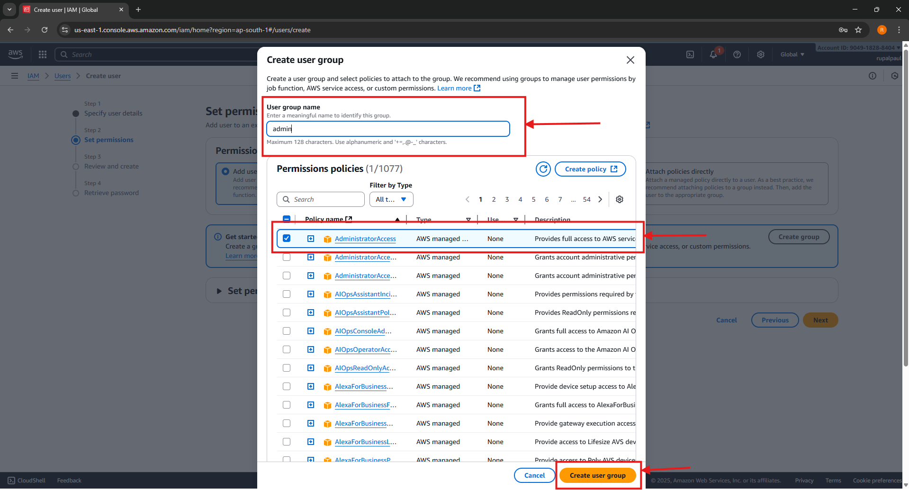
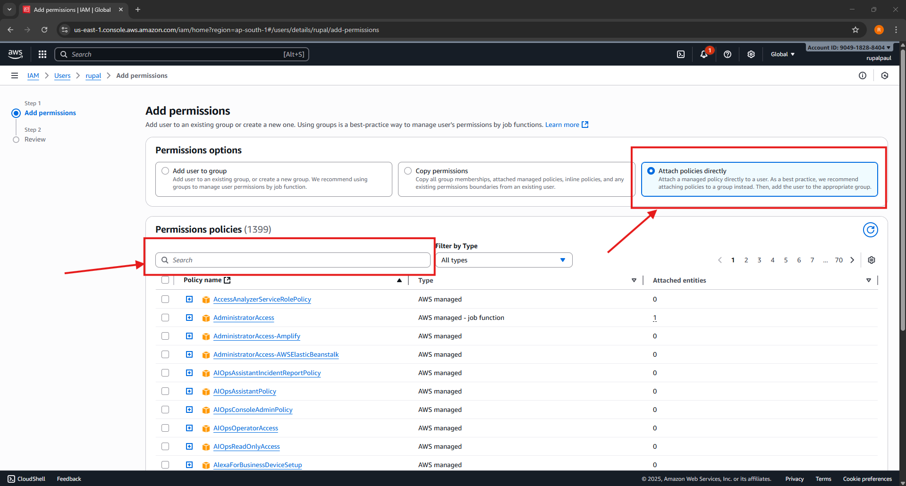

# AWS Identity and Access Management (IAM) 🔐



## What is IAM?

**AWS Identity and Access Management (IAM)** is like the security guard of your AWS account.  
It controls **who can access** your AWS resources and **what actions** they can perform.

When you open a new AWS account, you start with a **root user** – the master key that can do _everything_.  
But using the root account for daily work is risky, like walking around with all your bank passwords in one note.  
Instead, AWS gives you **IAM** to create secure users, assign permissions, and manage access safely.

📘 **In short:**  
IAM = “Who can do what on which AWS resource.”

---

## Why IAM is Important

Without IAM, anyone with access to your AWS account could accidentally delete servers or view data they shouldn’t.
IAM ensures **the right people have the right level of access**.

For example:

- A **developer** should launch EC2 instances but not delete S3 buckets.
- A **finance user** should only see billing information.
- A **read‑only intern** should view data but never modify it.

IAM let’s you design these access levels.

---

## Real‑World Analogy 🧩

Think of IAM as a company office with:

- A **building owner** → Root user
- **Employees with ID badges** → IAM users
- **Teams (e.g., HR, IT)** → IAM groups
- **Temporary contractors** → IAM roles
- **Access rules** → IAM policies

Example:  
Only HR staff can open HR files, IT can access servers, and contractors get temporary passes that expire.

---

## Core Concepts of IAM

| Concept       | Description                                           | Real‑World Example                                                          |
| ------------- | ----------------------------------------------------- | --------------------------------------------------------------------------- |
| **User**      | A person or application that interacts with AWS.      | You, your developer teammate, or an app that uploads data.                  |
| **Group**     | A collection of users that share permissions.         | An “Admin” group or a “Developers” group.                                   |
| **Role**      | Temporary access granted to users, apps, or services. | An EC2 instance that temporarily accesses S3 to back up data.               |
| **Policy**    | A document that defines permissions using JSON.       | A rulebook that says “Developers can launch EC2 but not delete S3 buckets.” |
| **Root user** | The full‑power account that owns everything.          | The founder of a company – rarely uses direct access.                       |

---

## Authentication vs Authorization ✈️


These are two key IAM terms often confused:

| Term               | Meaning                    | Analogy                                                 |
| ------------------ | -------------------------- | ------------------------------------------------------- |
| **Authentication** | Proving _who you are_.     | Showing your passport at the airport.                   |
| **Authorization**  | Proving _what you can do_. | Showing your boarding pass to get on a specific flight. |

📘 In AWS:

- Sign in (username & password) = **authentication**
- Permissions (defined in policies) = **authorization**

---

## Principle of Least Privilege 🧠

IAM follows the **principle of least privilege**, which means:

> “Give users only the permissions they need to do their job, nothing more.”

Example:

- A billing manager needs access to the **Billing Dashboard**, not to EC2 or S3.
- A developer needs full access in **dev environment**, but only read‑only in **prod environment**.

This limits mistakes and improves security.

---

## Key Features of IAM ⚙️

| Feature                               | What it Does                                             | Example                                                         |
| ------------------------------------- | -------------------------------------------------------- | --------------------------------------------------------------- |
| **Granular Permissions**              | Fine‑tuned access (allow/deny exact actions).            | Allow `s3:GetObject`, deny `s3:DeleteObject`.                   |
| **Multi‑Factor Authentication (MFA)** | Adds a second security layer using OTPs.                 | Login requires password + code from your phone.                 |
| **Identity Federation**               | Use existing login (Google, AD, etc.) to access AWS.     | Employees log in using their corporate Google account.          |
| **Temporary Credentials**             | Prevents permanent keys from being shared.               | EC2 assumes a role instead of hardcoding secrets.               |
| **Free Service**                      | IAM doesn’t cost anything; AWS services control billing. | You pay only for what IAM protects, like EC2 or S3.             |
| **Policy Simulator**                  | Test if policies work as expected.                       | Check whether `User_A` can delete an S3 bucket before applying. |

---

## IAM in Action: Everyday AWS Scenario 💡

Imagine you run an online store hosted on AWS:

1. **Your root user** sets up the AWS account.
2. You create IAM **users** – `dev_team`, `finance_team`, and `support_team`.
3. You create IAM **groups**:
   - `Developers`: Full EC2 access
   - `Finance`: Read billing only
   - `Support`: View S3 logs and troubleshoot
4. Each team gets added to a group that defines its permissions.
5. You set up **MFA** for everyone and disable the root user for daily use.

📘 _Result:_  
Your AWS environment becomes secure, organized, and easy to manage. Everyone has what they need—nothing more.

---

## IAM Policy Basics 📝

Policies are simple **JSON files** that define permissions.

Example: Allowing read/write access to one S3 bucket:

```bash
{
    "Version": "2012-10-17",
    "Statement": [
        {
            "Effect": "Allow",
            "Action": [
                "s3:GetObject",
                "s3:PutObject"
            ],
            "Resource": "arn:aws:s3:::my-bucket/*"
        }
    ]
}

```

**Explanation:**

- `Effect`: Allow or Deny
- `Action`: What can be done (`s3:GetObject`)
- `Resource`: Which resources are affected (`my-bucket/*`)

📘 _Analogy:_  
It’s like a door access list:

> “John can enter the meeting room and storage, but not the pantry.”

---

## Summary

IAM is the **foundation of AWS security**. Learning it early helps you stay safe and organized in cloud environments.  
Once you understand the logic of _who → can do what → on which resource_, you’ll be ready to master AWS permissions confidently.

---

**Next Step →**  
You’re now ready to go hands-on:

- Create users and groups
- Attach policies
- Enable MFA
- Test access using AWS CLI and IAM Policy Simulator

# Practical Guide: Creating IAM User, Group & Login

---

## Step 1: Go to AWS Console and Search for IAM

- Log in to your AWS account using the root credentials.
- In the top search bar, type “IAM”.
- Click the IAM service that appears in search results.


---

## Step 2: Access the IAM Dashboard

- The IAM dashboard page will show options like Users, Groups, Roles, Policies etc.
- Here you manage all things related to identities and access.
- In the left sidebar, click **Users**.


---

## Step 3: Create a New IAM User

- Click the **“Add users”** button.
- Enter a username (e.g. `rupal`).
- Select _AWS Management Console access_ (so this user can log in).
- Choose “Custom password” and set a secure password (or let AWS generate one).
- Tick the box “Require password reset” (Optional).


---

## Step 4: Create a New IAM Group

- Click **“Create group”**.
- Enter a group name (e.g. `admin`).
- Choose one or more policies for this group (for example, attach the built-in `AdministratorAccess` for developer access).
- Click **“Create group”** to finish.




---

## Step 5: Add User to Group

- Click **"Add user to groups"**.
- Select your new group (`admin`) and next.
- Give tags(Optional) then **Create**

Your IAM user will be created


## 

## Step 5.5: Verify User, Group, and Policy

Before proceeding, let’s confirm that your user and group setup is correct:

- Go to **IAM → Users** and ensure your new user appears in the list.
- Click on the **user name** → open the **Groups** tab → confirm the user is part of the `admin` group.
- Then open the **Permissions** tab → verify the correct policies (e.g., `AdministratorAccess`) are attached either directly or through the group.

This ensures the user has the right access before proceeding.


---

## Step 6: Create Account Alias (Friendly Login URL)

- In the IAM dashboard sidebar, find and click **Account Alias**.
- Click **Create** next to “Account Alias”.
- Enter a short, friendly name (like `aws-rupal-v0`).
- Click on **Create Alias**.

This changes your sign-in URL to  
`https://aws-rupal-v0.signin.aws.amazon.com/console`


## Step 7: Get IAM User Sign-In Link

- From the **IAM dashboard home**, look for **IAM users sign-in link** (sometimes in the top banner or Account settings).
- Copy the link which includes the alias.
- Share this secure sign-in URL with the IAM user.

## 

---

## Step 8: Log In as IAM User

- Open the copied sign-in URL in a new browser window.
- Enter your IAM username (e.g. `rupal` must be auto-filled) and the password.
- If MFA is enabled, enter your code from your authentication device.

Now you’re signed in as a regular IAM user—only with permissions granted via group policies.


---

## Summary

You have now:

1. Searched and found the IAM dashboard.
2. Created a user and a group.
3. Attached permission policies to the group.
4. Joined your user to the group.
5. Set a friendly alias for easy login.
6. Used the sign-in URL to log in securely as an IAM user (not root).

With these steps and your own screenshots, anyone reading your docs can repeat the setup with confidence!

# How to Attach and Create IAM Policies

---

## Attaching an Existing Policy to a User or Group

### 1. Go to the "Policies" Section

- In the IAM dashboard, click **Policies** in the left sidebar.
- You will see a list of existing AWS-managed and customer-managed policies.


---

### 2. Attach Policy to User/Group

- Find the user (or group) to whom you want to attach a policy.
- Click the **Add permissions** button on the user's summary page.


---

### 3. Search and Select Policy

- In the "Add permissions" wizard, use the **search box** to quickly find the policy you need (e.g., `IAMReadOnlyAccess`).
- Select the desired policy from the list.



---

### 4. Review and Add Permissions

- After selecting policy, click **Next** to review.
- Finish by clicking **Add permissions** to apply the policy to the user or group.


---

### 5. See Policy Attached in User Permissions

- Now, you can see the policy listed under the user’s "Permissions policies."


---

## Creating a Custom IAM Policy

### 1. Go to Policies & Click "Create Policy"

- Navigate to **Policies** in IAM sidebar.
- Click on the **Create policy** button (top right).


---

### 2. Select Service and Set Permissions

- In the policy creation wizard, use the **Visual editor**.
- **Choose a service** (e.g., IAM, S3, EC2).
- Under Actions, **select the specific actions** you want to allow (like `ListUsers`).


---

### 3. Specify Resources

- Define whether the permissions apply to **all resources** or just specific ones.
- Leaving it as "All" applies the action everywhere (not recommended for production).


---

### 4. Add Policy Details & Review

- Give your policy a **name** and **description** explaining its purpose.
- (Optionally) Add tags for easier management.
- Click **Create policy**.


---

### 5. View the Policy and JSON

- Once created, policies can be viewed in the list.
- Click the **JSON** tab to see (or copy) the policy document.


---

## Summary

- **Attaching a policy** gives a user/group the permissions defined by that policy.
- **Creating a policy** allows you to grant exactly the permissions you want, using the visual editor or by writing JSON directly.
- Always review the permissions and test with a non-production user first to avoid granting excessive access.

# How to Create an IAM Role

---

## 1. Open the Roles Section in IAM

- On the IAM dashboard, click **Roles** in the left sidebar.
- You’ll see a list of all existing roles.


---

## 2. Start Creating a New Role

- Click the **Create role** button (top right).


---

## 3. Select a Trusted Entity

- A trusted entity is what will use this role. In most cases, this is **AWS service**.
- For example, choose **AWS service** if you want EC2 to use this role.
- Select the desired service or use case (e.g., "EC2").


---

## 4. Choose Permissions (Attach Policies)

- Search and select the policy or policies to attach to this role (e.g., `IAMReadOnlyAccess`).
- Check the box next to your policy, then click **Next**.


---

## 5. (Optional) Add Tags

- You can add key-value tags to help organize and identify the role (optional).

---

## 6. Name and Review the Role

- Enter a **role name** (e.g., `MyDemoRole`).
- Add a brief description.
- Review the trusted entity, permissions, and policy JSON for accuracy.


---

## 7. Create the Role

- Click the **Create role** button at the bottom right to finish.


---

## 8. See Your New Role in the List

- Your new role will appear in the Roles list.
- Click on the role name to view or modify its permissions and trust relationships.


---

## Summary

- IAM Roles allow AWS services (like EC2 or Lambda) or trusted users to perform specific actions.
- You defined who trusted the role, what the role can do (attached permission policies), and its name.
- Use roles whenever
